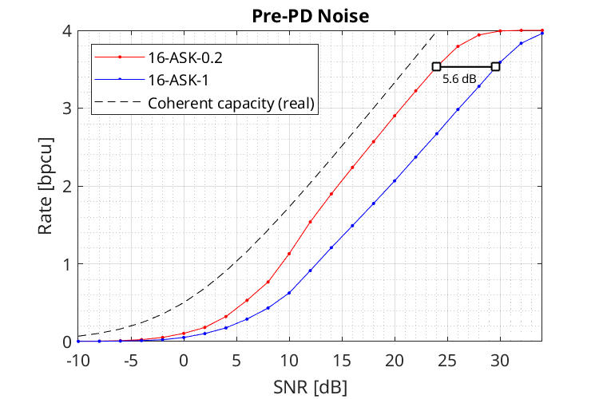
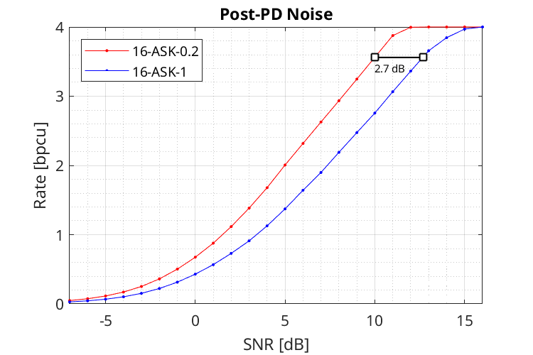
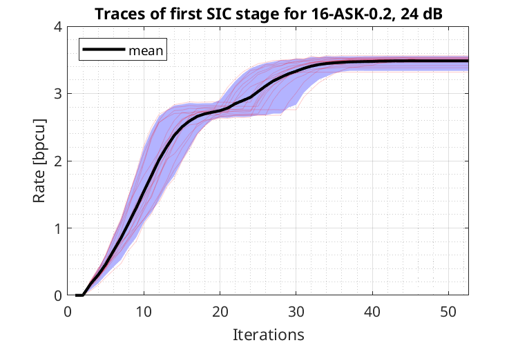
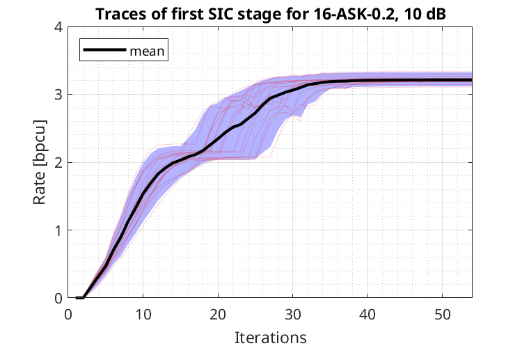
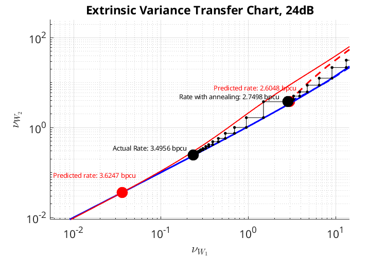

# dd-sic-gvamp: Information Rates of Approximate Message Passing for Bandlimited Direct-Detection Channels

This repository contains the program code for the paper "Information Rates of Approximate Message Passing for Bandlimited Direct-Detection Channels", which was submitted to the *IEEE Trans. Inf. Theory* on 1 August, 2025. A preprint is [available](https://www.arxiv.org/pdf/2508.01438). 

## Citation

The software is provided under the open-source [MIT license](https://opensource.org/licenses/MIT). If you use the software in your academic work, please cite the accompanying document as follows: 

> D. Plabst, M. Akrout, A. Mezghani and G. Kramer, "Information Rates of Approximate Message Passing for Bandlimited Direct-Detection Channels," _arXiv e-prints_, Art. no. arXiv:2508.01438, 2025. doi:10.48550/arXiv.2508.01438. Available: [https://www.arxiv.org/pdf/2508.01438](https://www.arxiv.org/pdf/2508.01438)

The corresponding BibTeX entry is: [cite.bib](cite.bib).

## Fiber-Channel with Direct Detection 

We consider short-reach optical communication with a direct detector (DD) at the receiver, i.e., a single photodiode that performs the optical-to-electrical conversion[^1][^2]. The standard single-mode fiber (SSMF) linking the transmitter and receiver operates in the C-band, where chromatic dispersion induces intersymbol interference (ISI). The model considers both optical noise arising from optical amplification and thermal noise introduced during photodetection: 

$$
Y(t) =  g_\mathrm{rx}(t) * \left(\left\lvert X(t) + N_1(t)\right\rvert^2 + N_2(t) \right)
$$

with the 
- baseband signal $X(t) = \sum_k X_k  a(t-k T)$  and symbol period $T$
- i.i.d. discrete channel inputs $X_k$ from the constellation $\mathcal{A}$ 
- filter $a(t)$ that combines transmit pulseshaping (DAC) and dispersive fiber effects
- filter $g_\mathrm{rx}(t)$ that models the ADC at the receiver
- bandlimited circularly-symmetric complex Gaussian optical noise $N_1(t)$
- real white Gaussian electrical noise $N_2(t)$.

The DD doubles the signal bandwidth. We oversample $Y(t)$ at $N_\text{os} = 2$. The samples are passed to the generalized vector approximate message passing (GVAMP) receiver, which computes symbol a-posteriori probabilities for decoding. GVAMP can use successive interference cancellation (SIC) to increase information rates. Note that, due to the DD operation $|\cdot|^2$, symbol detection becomes a phase retrieval problem.

We use M-ASK modulation with constellation 

$$
 \mathcal{A} = 
    \frac{1}{M-1} \cdot \left\lbrace \pm1,\pm3,\ldots \pm (M-1)\right\rbrace + o
$$

and offset $o \in [0,1]$. For example, 4-ASK-0 is bipolar with $\mathcal{A} = \left\lbrace\pm 1, \pm 3\right\rbrace / 3$, while 4-ASK-1 is unipolar with $\mathcal{A} = \left\lbrace 0,1,2,3\right\rbrace / 3$.

The code examples below consider the setup:

Parameter                 | Value                         
| ------------------ |-------------------------- |
Modulation order          | $M = 16$
Pulse shape               | Frequency domain root-raised cosine pulse
Roll-off factor           | $0.01$
Fiber length              | $4.0  \mathrm{km}$ (C-band, $\lambda=1550 \mathrm{nm}$)
Symbol rate               | $300  \mathrm{GBaud/s}$ 
Noise                     | Optical or electrical   

The optical or electrical noise variance is fixed and we vary the average transmit power $P_\text{tx}$. 

We provide two illustrative examples with detailed output:
- [ex1a_prePD_noise_iter.m](ex1a_prePD_noise_iter.m) computes rates for SSMF _with_ optical amplification. Here, the post-PD noise (optical noise) dominates. 
- [ex1b_postPD_noise_iter.m](ex1b_postPD_noise_iter.m) computes rates for SSMF _without_ optical amplification. Here, the post-PD noise (electrical noise) of the DD dominates.

We used [ex1a_prePD_noise.m](ex1a_prePD_noise.m) and [ex1b_postPD_noise.m](ex1b_postPD_noise.m) to compute rates across a range of SNR values, resulting in the plots shown below.

### Rates vs. SNR

The plots show rates versus SNR for 16-ASK with offset $o$, $L=4\mathrm{km}$ and SIC with $S=4$ levels. A smaller constellation offset $o$ is significantly more power efficient. Setting $o=0.2$ gains $\approx 5.6 \mathrm{dB}$ and $\approx 2.7 \mathrm{dB}$  over legacy PAM modulation ($o=1$)  for optical and  electrical noise, respectively. For optical noise, the gap of 16-ASK-0.2 to the (real) coherent capacity is $\approx 0.4\mathrm{bpcu}$.  

| Example 1a (Optical Noise) | Example 1b (Electrical Noise)|
|--------|--------|
|  |  |

### Rates vs. Iterations

The plots show the achievable rates versus the number of GVAMP iterations for 16 transmitted blocks, each consisting of 2048 16-ASK-0.2 symbols at a fixed SNR. The fiber length is $L = 4\mathrm{km}$ SSMF and the GVAMP receover uses separate detection and decoding (SDD), i.e., $S = 1$. All 16 blocks converge to rates around the mean value, indicated by the black curve.

| Example 1a (Optical Noise) | Example 1b (Electrical Noise)|
|--------|--------|
|  |  |

### Extrinsic Information Transfer Chart (EXIT) Chart

GVAMP convergence can be predicted using extrinsic-variance transfer charts. The figure below shows the variance-based EXIT functions together with the actual GVAMP trajectory (black) for SIC with $S=1$, 16-ASK-0.2, dominant optical noise and an SNR of 24 dB. The EXIT chart fixed point accurately predicts the achieved GVAMP performance.

| Example 1a (Optical Noise)|
|--------|
|  |

> [!NOTE]
> GVAMP uses variance annealing and automatic damping to avoid local minima. The annealing has been chosen to work over a wide range of parameters. Adjusting the annealing and damping parameters to the constellation, fiber length and SNR can further increase performance and reduce complexity. 

## Usage

Start MATLAB and execute 

    ex1a_prePD_noise_iter.m
    ex1a_prePD_noise.m
    ex1b_postPD_noise_iter.m
    ex1b_postPD_noise.m

to choose one of the examples. 

[^1]: D. Plabst, T. Prinz, T. Wiegart, T. Rahman, N. Stojanović, S. Calabrò, N. Hanik and G. Kramer, "Achievable Rates for Short-Reach Fiber-Optic Channels With Direct Detection," in *J. Lightw. Technol.*, vol. 40, no. 12, pp. 3602-3613, 15 June15, 2022, doi: 10.1109/JLT.2022.3149574. [[Xplore]](https://ieeexplore.ieee.org/document/9707620)

[^2]: T. Prinz, D. Plabst, T. Wiegart, S. Calabrò, N. Hanik and G. Kramer, "Successive Interference Cancellation for Bandlimited Channels with Direct Detection," in *IEEE Trans. Commun.*, vol. 72, no. 3, pp. 1330-1340, March 2024, doi: 10.1109/TCOMM.2023.3337254.  [[Xplore]](https://ieeexplore.ieee.org/document/10328977)

## Software Requirements 

The code was tested under MATLAB R2024b Update 5. 

## Other Software 

- This software includes functions from [https://sourceforge.net/projects/gampmatlab/](https://sourceforge.net/projects/gampmatlab/) (Sundeep Rangan, Philip Schniter and others). 
- This software also includes functions from https://github.com/abhranildas/gx2 (Abhranil Das), which computes generalized chi-square distributions. 